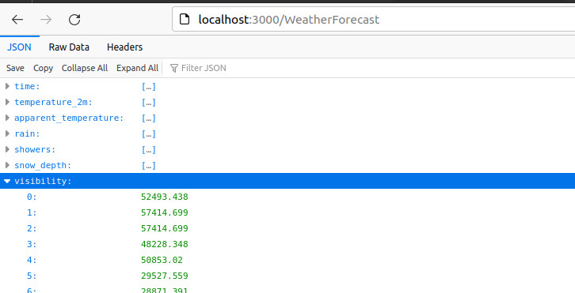
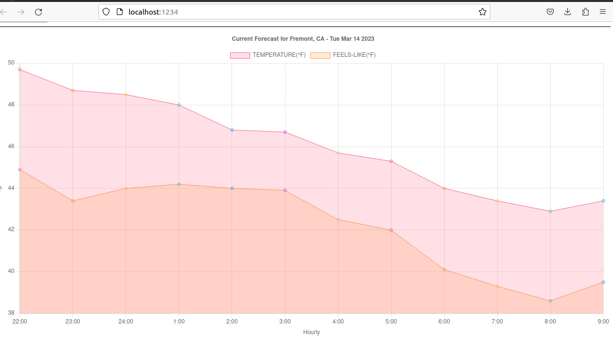

# How Developers Done It

Let assume you have created a git branch to work on an assigned feature.  We will skip that and jump right into this topic of subtask development. 

There are two separate code bases in this repo.  `JSON_SERVER` and `CHARTS`.

The first is a simplified backend server and the second is a browser (client) app.

Often, engineering tasks are broken into subtasks.  A subtask small enough that the engineer can quickly setup an ecosystem for it.  

This is a development senario where the engineer is tasked with developing the front-end, interfacing the `chart.js` library.  She needs real-time sample datapoints for the charts.  

All she needed is a few json files mirroring the backend APIs responses.
`json-server` is then used to simulate the backend.  She now can focus on the frontend task.   

## JSON SERVER 

The `json-server` provides mocked APIs data with complete CRUD operations.

Reference [npm json-server](https://www.npmjs.com/package/json-server)  Make sure you read to the end of the document to appreciate this development tool.

Run `npm i json-server` to install or update. 

## Setting up the backend ##

<strong>1.  Create a directory `JSON_SERVER`</strong>

<strong>2.  Create a file named `air-quality.json`</strong>
with content of a twenty-four hour datapoints.  

```json
{
"time": ["2023-03-11T00:00","2023-03-11T01:00","2023-03-11T02:00","2023-03-11T03:00","2023-03-11T04:00","2023-03-11T05:00","2023-03-11T06:00","2023-03-11T07:00","2023-03-11T08:00","2023-03-11T09:00","2023-03-11T10:00","2023-03-11T11:00","2023-03-11T12:00","2023-03-11T13:00","2023-03-11T14:00","2023-03-11T15:00","2023-03-11T16:00","2023-03-11T17:00","2023-03-11T18:00","2023-03-11T19:00","2023-03-11T20:00","2023-03-11T21:00","2023-03-11T22:00","2023-03-11T23:00"],
"pm10": [19.4,18.2,21.9,29.6,31.4,31.4,29.9,28.3,29.3,32,32.2,31.2,27.4,26.5,26.4,28,29.6,25.4,21.9,18.7,16.8,16.6,16.4,10.6],
"pm2_5": [12.8,12,14.8,20.2,21.5,21.5,20.6,19.5,20.3,22.3,22.4,21.6,18.8,18.2,18.2,19.3,20.4,17.2,14.6,12.4,11.1,11,11,7.1],
"carbon_monoxide":[194,260,353,459,499,523,543,557,565,564,547,519,352,363,379,383,362,328,279,243,205,164,145,132],
"nitrogen_dioxide":[17.7,33.7,56.4,79.8,84.6,83.3,80.6,80.8,81,80.1,77.8,74.6,49.1,47.8,46,42.7,39.5,35.7,30,24.5,18.4,12.2,9.8,8.8],
"sulphur_dioxide":[2.9,3.3,3.8,4.3,4.5,4.5,4.6,4.7,4.7,4.7,4.6,4.5,2.2,2.2,2.2,2.2,2.3,2.4,2.4,2.2,1.9,1.5,1.3,1.1],
"ozone":[79,59,30,1,0,0,0,0,0,0,0,1,10,9,8,9,13,19,28,36,46,55,57,56],
"aerosol_optical_depth":[0.11,0.11,0.11,0.12,0.13,0.14,0.12,0.11,0.11,0.11,0.11,0.11,0.09,0.1,0.11,0.11,0.11,0.11,0.12,0.14,0.13,0.11,0.09,0.09],
"dust":[0,0,0,0,0,0,0,0,0,0,0,0,0,0,0,0,0,0,0,0,0,0,0,0],
"uv_index":[0.55,0.25,0,0,0,0,0,0,0,0,0,0,0,0,0,0.05,0.2,0.6,1.1,1.25,1.15,1.3,1.85,1.05],
"uv_index_clear_sky":[1.2,0.3,0,0,0,0,0,0,0,0,0,0,0,0,0,0.15,0.75,1.95,3.5,4.8,5.45,5.1,3.95,2.45]
}
```


<strong>3.  Create another file `weather.json`</strong> with content of a twenty-four hour of weather datapoints.

```json
{
    "time":["2023-03-14T00:00","2023-03-14T01:00","2023-03-14T02:00","2023-03-14T03:00","2023-03-14T04:00","2023-03-14T05:00","2023-03-14T06:00","2023-03-14T07:00","2023-03-14T08:00","2023-03-14T09:00","2023-03-14T10:00","2023-03-14T11:00","2023-03-14T12:00","2023-03-14T13:00","2023-03-14T14:00","2023-03-14T15:00","2023-03-14T16:00","2023-03-14T17:00","2023-03-14T18:00","2023-03-14T19:00","2023-03-14T20:00","2023-03-14T21:00","2023-03-14T22:00","2023-03-14T23:00"],
    "temperature_2m":[57.4,57.5,56.7,56.9,56.6,56.3,56.2,55.8,55.7,55.9,57.3,60.3,61.9,62.6,62.7,60.9,58.4,55,53.4,52.2,51,49.7,48.7,48.5],
    "apparent_temperature":[57.7,58.1,56.7,56.6,54.9,54.8,54.9,53.9,50.4,49.2,52.6,54.5,55.2,55.2,57.5,54.6,53.8,50.1,48.5,49,46.4,44.9,43.4,44],
    "rain":[0,0,0,0.02,0.024,0.031,0.024,0.024,0.063,0.016,0.008,0.008,0.004,0,0,0,0,0,0,0,0],
    "showers":[0.004,0,0,0,0,0,0,0.004,0,0,0.004,0,0,0.004,0.004,0.004,0.004,0.004,0,0.004,0,0.004],
    "snow_depth":[0,0,0,0,0,0,0,0,0,0,0,0,0,0,0,0,0,0,0,0,0],
    "visibility":[52493.438,57414.699,57414.699,48228.348,50853.02,29527.559,28871.391,34776.902,46259.844,50196.852,23622.047,54133.859,53805.773,54790.027,64632.547,64960.629,59383.203,50524.934,46916.012,44947.508,43635.172,43635.172,45931.758,50853.02]
}
```

Typically, we invoke `json-server` command to watch (`--watch`) a single json file.

```shell
json-server --watch db.json

 or

json-server --host 0.0.0.0 --port 9999 --watch plans.json
```

However, we could import multiple json files into an `index.js` 

```javascript
const airquality = require('./air-Quality.json');
const weather = require('./weather.json');

module.exports = () => ({
  AirQuality: airquality,
  WeatherForecast: weather
});
```

Next, invoke the `json-server` command as follow:

```shell 
json-server --host 0.0.0.0 --watch index.js
```

Access the backend URI: http://localhost:3000




<hr>

## Frontend development

For simplicity, we will use the development server, `parcel` to test and build the frontend app.

<strong>1.  Create directory `CHARTS`</strong>

<strong>2.  Initialize javascript environment</strong>

```shell
npm init -y
npm install --save-dev parcel
```

<strong>3.  Create the frontend `index.html` file</strong>

Interface `chart.js` (see [reference](https://www.chartjs.org/docs/latest/samples/information.html)).

For proof of concept, I cramped everything into index.html file.

For best practice, do not use <em>`synchronous XMLHttpRequest`</em> method in your production code.  Also, split your scripts into separate file.

<strong>4. Run</strong> 
```javascript
npm run test

or 

npm start
```

## Output




## Conclusion

One of many tricks front-end engineers use to quickly accomplish subtasks is the use of simulated datapoints, easily produce with CRUD server `json-server`.

The only work remain is to configure the actual URIs when merging to code base.